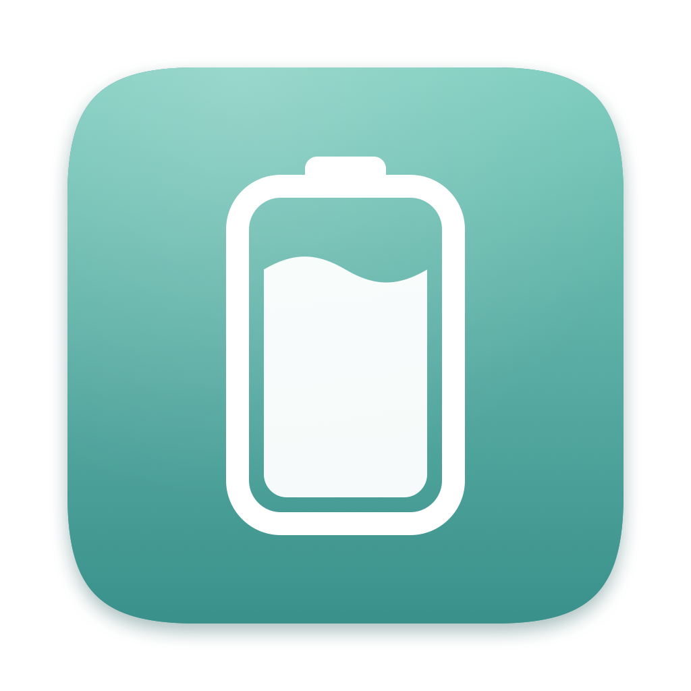
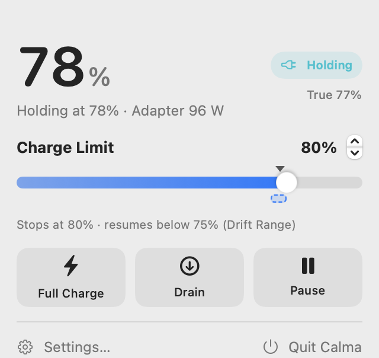
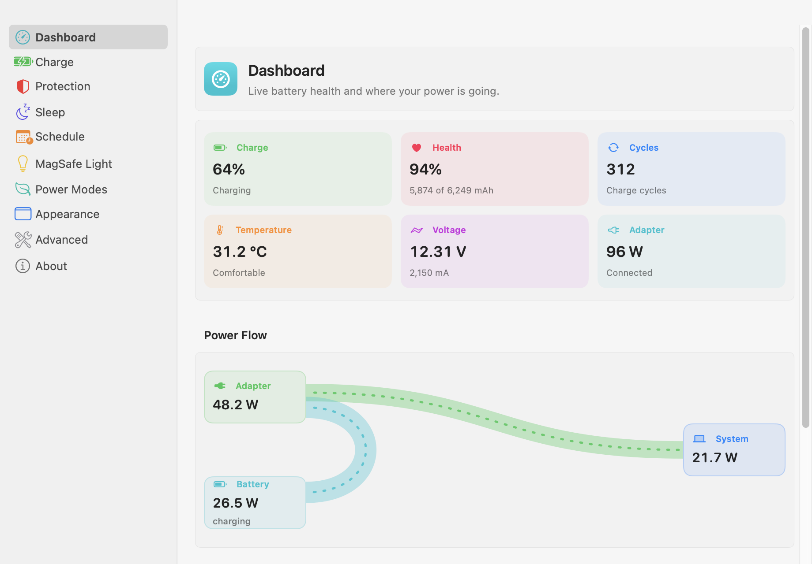
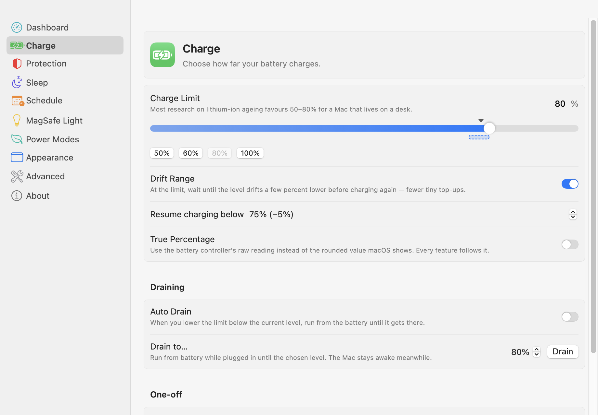
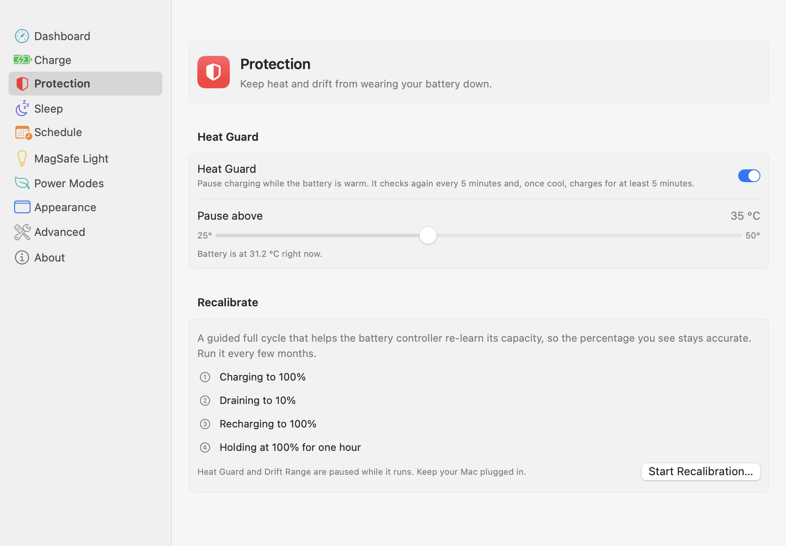
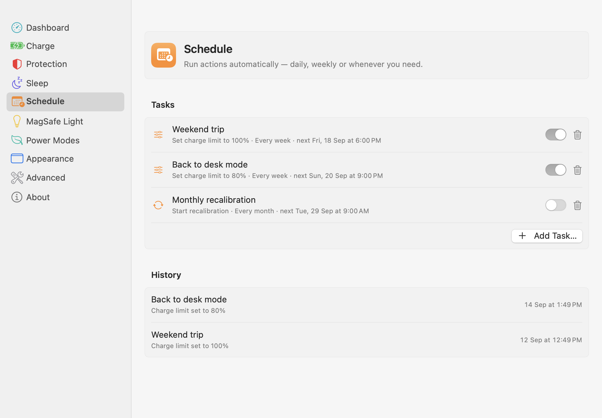
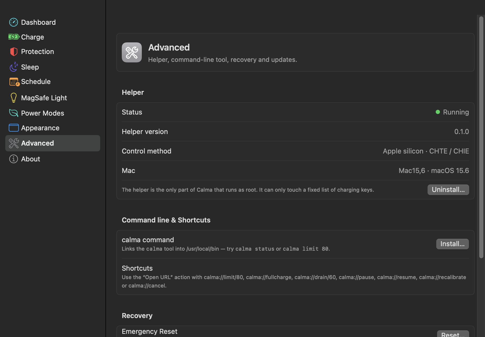
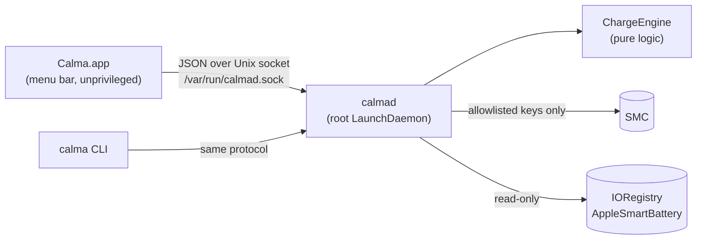

<div align="center">



# Calma

**Keep your MacBook's battery calm.**

A free, open-source menu bar app that limits how far your Mac charges, so the battery spends less time full and lasts longer.

[](https://github.com/Milanpatel35/calma/actions/workflows/ci.yml)
[](https://github.com/Milanpatel35/calma/releases/latest)
[](https://github.com/Milanpatel35/calma/releases)
[](LICENSE)
[](#compatibility)
[](CONTRIBUTING.md)

[**Download**](https://github.com/Milanpatel35/calma/releases/latest) · [Website](https://milanpatel35.github.io/calma/) · [Features](#features) · [Safety](#safety) · [Contributing](CONTRIBUTING.md)

<picture>
  <source media="(prefers-color-scheme: dark)" srcset="screenshots/popover-dark.png">
  
</picture>

</div>

---

Lithium-ion batteries wear fastest when they sit at 100%. If your Mac lives on a desk and stays plugged in all day, the battery spends most of its life in exactly that state. Calma holds the charge where you choose (50%, 80%, anything from 20% to 100%) and lets the adapter run the Mac.

**Every feature is free.** There's no Pro version, no licence key, no account and no telemetry.

## Download

<a href="https://github.com/Milanpatel35/calma/releases/latest"><b>⬇️ Download the latest Calma.dmg</b></a>

**Or install from Terminal, with no Gatekeeper warning** (verifies the checksum, then installs):

```sh
curl -fsSL https://raw.githubusercontent.com/Milanpatel35/calma/main/Scripts/install.sh | bash
```

1. Open the `.dmg` and drag **Calma** to **Applications**.
2. Open Calma. Because these builds aren't notarized yet, macOS says *"Apple could not verify 'Calma' is free of malware"* and offers only **Move to Trash** and **Done**. Click **Done**, then:
   - **macOS 15 or later** (including 26 and 27):  **→ System Settings → Privacy & Security**, scroll to **Security**, click **Open Anyway** next to *"Calma" was blocked*, and confirm. Apple removed the old right-click → Open shortcut in macOS 15.
   - **macOS 13–14:** right-click Calma in Applications and choose **Open**.
   - **Terminal, any version:** `xattr -dr com.apple.quarantine /Applications/Calma.app`

   Full walkthrough, including how to verify the download: [docs/INSTALL.md](docs/INSTALL.md).
3. Click **Install Helper** in the menu bar popover and enter your administrator password. The helper (`calmad`) is the small background service that talks to the charging controller.

**Homebrew:** coming soon (tracked in the roadmap).

Requires macOS 13 Ventura or later. Apple Silicon and Intel builds ship as one universal app. See [Compatibility](#compatibility), and especially the [macOS 27 note](#macos-27-status).

## Features

| Feature | What it does |
|---|---|
| **Charge Limit** | Hold the battery at any level from 20% to 100%. |
| **Drain to…** | Run from the battery while still plugged in, down to a level you pick. |
| **Auto Drain** | Lower the limit below the current level and Calma drains down to it by itself. |
| **Drift Range** | Once at the limit, only resume charging after the level drops a few percent, so the battery isn't topped up one percent at a time. |
| **Heat Guard** | Pause charging when the battery is warmer than your threshold (default 35 °C), using 5-minute pause and resume windows so it doesn't flip back and forth. |
| **Recalibrate** | A guided cycle: 100% → 10% → 100% → hold for an hour → back to your limit. It helps the battery's own percentage reading stay accurate. |
| **True Percentage** | Use the battery controller's raw percentage instead of the smoothed value macOS shows. |
| **Full Charge** | A one-tap charge to 100% before a trip. Your limit comes back when you unplug. |
| **Pause Charging** | Stop charging completely until you turn it back on. |
| **Pause on Sleep** | Stop charging just before sleep so the Mac can't charge to 100% overnight. |
| **Stay Awake to Limit** | Keep the Mac awake while it charges up to the limit. The display can still sleep. |
| **Keep Limit After Quit** | Keep enforcing the limit after you quit the app. Off by default. |
| **Fast User Switching** | The helper runs system-wide, so one limit applies to every user, and the app shows who changed it last. |
| **Schedule** | Set a limit, full charge, recalibrate, pause, resume or drain on a schedule: once, daily, weekdays, weekly, every two weeks or monthly. Missed runs can catch up, and there's a history log. |
| **MagSafe Light** | Green at your limit, amber while charging or draining, optional blinking, or always off. Only shown on Macs with MagSafe 3. |
| **Power Flow** | A live diagram of where the watts go: adapter, battery and system. |
| **Low / High Power Mode** | Switch the macOS power modes from the app or the CLI. |
| **Menu bar states** | Different icons for charging, paused, draining, on battery and paused for heat. |
| **CLI & URL scheme** | The `calma` command and `calma://` links make everything scriptable and work with Shortcuts. |
| **Accessible & localisable** | VoiceOver labels, full keyboard navigation and reduced motion support. English plus a partial Hindi translation. |

## Screenshots

| Dashboard | Charge |
|---|---|
|  |  |
| **Protection** | **Schedule** |
|  |  |
| **Advanced** | |
|  | |

Screenshots are rendered from the real SwiftUI views with `swift run CalmaApp --render-screenshots screenshots`.

## Which limit should I use?

Most research on lithium-ion ageing suggests keeping the battery somewhere between about 50% and 80%.

- **80%** is a good everyday choice. It's noticeably gentler than 100% and still leaves a useful reserve when you unplug.
- **50–60%** is kinder still if your Mac almost never leaves the desk.
- Use **Full Charge** the evening before a day away from a power outlet.
- Heat matters too. Turn on **Heat Guard** if your Mac runs warm.

## How it works

macOS exposes charging control through keys on the System Management Controller (SMC) that Apple doesn't document. Only root can write them. Calma separates the parts that need root from the parts that don't:



- **`calmad`** is the only process that writes to the SMC. It runs the control loop, so your limit keeps working while the app is closed and when you switch users.
- The daemon accepts a **small, fixed set of commands**. There is no "write any key" command, and the daemon refuses every key that isn't on its allowlist.
- Every command that changes something requires the caller to be **root or a member of the `admin` group**. The daemon checks the caller with `getpeereid`.
- **`ChargeEngine`** decides what to do. It's a pure function with no side effects, and unit tests cover every rule.

Why a Unix socket instead of XPC with `SMAppService`? Validating XPC code signatures needs a paid Apple Developer ID. The socket design works for unsigned community builds. Moving to XPC once releases are notarized is on the roadmap. Full details are in [docs/ARCHITECTURE.md](docs/ARCHITECTURE.md).

## Safety

Writing SMC keys controls real hardware, so Calma is built to fail safe:

- Charging goes back to stock behaviour when the helper stops, the Mac shuts down, or you uninstall, unless you turned on *Keep Limit After Quit*.
- The app sends a heartbeat every 20 seconds. If *Keep Limit After Quit* is off and the helper hears nothing for 90 seconds, it restores normal charging.
- On first run the helper saves the original key values to `/Library/Application Support/Calma/smc-probe.json`.
- Every SMC write is logged with the key, old value, new value and reason to `/Library/Logs/Calma/calmad.log`. The log rotates and never leaves your Mac.
- Draining is refused below 20% or when the battery temperature can't be read.
- The **Emergency Reset** button and `calma reset` restore everything.

If something goes wrong, [docs/RECOVERY.md](docs/RECOVERY.md) explains how to get back to normal. Nothing Calma does is permanent: an SMC reset always restores stock behaviour. Also see [docs/SAFETY.md](docs/SAFETY.md).

## Privacy

Calma makes no network requests except an optional update check against GitHub Releases, which is **off by default**. It has no analytics, no crash reporting and no account.

## macOS 27 status

> [!IMPORTANT]
> **On macOS 27, Calma currently runs in monitoring mode.**
>
> The macOS 27 firmware removed every publicly documented charge-control key (`CH0B`, `CH0C`, `CHTE`, `CH0I`). We confirmed this on a MacBook Pro (Mac16,1, M4). Apple's new keys aren't documented and can't be read without privileges, and other projects report that even root is denied. Calma won't guess at undocumented values on your charging hardware.
>
> On macOS 27 you still get live telemetry, Power Flow, battery health, temperature and history. Charge limiting is turned off, and the app tells you so clearly. Meanwhile you can use macOS's built-in **System Settings → Battery → Charge Limit** (80–100%), which Calma detects and shows read-only.
>
> We also looked at a workaround that toggles the adapter on and off, and rejected it on purpose: it repeatedly cycles the battery, which is the opposite of what Calma is for. If you know the new interface, see the **"macOS 27 charge control"** help-wanted issue.

## CLI

The app bundle includes the `calma` tool. You can link it to `/usr/local/bin` from **Settings → Advanced**.

```sh
calma status               # current level, limit, state
calma limit 80             # set the charge limit
calma pause | resume       # stop / restart charging
calma fullcharge           # charge to 100% once, revert on unplug
calma drain 60             # run from battery down to 60%
calma recalibrate          # start the recalibration cycle
calma cancel               # cancel full charge / drain / recalibrate
calma drift on 5 | off     # Drift Range
calma heat on 35 | off     # Heat Guard
calma autodrain on | off
calma led system | status | off
calma lowpower on | off
calma highpower on | off
calma reset                # emergency reset
calma probe                # read-only SMC key dump (no root needed)
calma json                 # full status as JSON
```

## Shortcuts

Use the **Open URL** action with any of these:

```
calma://limit/80    calma://fullcharge   calma://drain/60
calma://pause       calma://resume       calma://recalibrate
calma://cancel      calma://reset
```

Or use **Run Shell Script** with the CLI, for example `calma status`. Native App Intents are on the roadmap.

## Build from source

You'll need macOS 13+ and Xcode 15+ (or the Swift 5.9+ toolchain).

```sh
git clone https://github.com/Milanpatel35/calma.git
cd calma
swift build
swift test
Scripts/build-app.sh          # → dist/Calma.app, dist/Calma-<version>.dmg and .zip
```

Build output is universal (arm64 + x86_64) and ad-hoc signed unless `DEVELOPER_ID` is set. For development, install your debug helper with `sudo Scripts/install-daemon.sh .build/debug`. See [CONTRIBUTING.md](CONTRIBUTING.md).

## Compatibility

| Mac | Status |
|---|---|
| Intel MacBooks (2016+) | Supported through `BCLM`, with `CH0B`/`CH0C`/`CH0I` where present. **Needs hardware reports** |
| Apple Silicon, macOS 14 or earlier firmware | Supported through `CH0B`/`CH0C` + `CH0I`. **Needs hardware reports** |
| Apple Silicon, macOS 15–26 firmware | Supported through `CHTE` + `CHIE`. **Needs hardware reports** |
| Apple Silicon, macOS 27 | Monitoring mode only; see [macOS 27 status](#macos-27-status). Verified on Mac16,1 |

SMC behaviour varies by model and firmware. [docs/SMC_KEYS.md](docs/SMC_KEYS.md) lists what has been confirmed. If your Mac isn't listed, please [file a hardware report](https://github.com/Milanpatel35/calma/issues/new?template=hardware_report.yml). It's the most useful thing you can contribute.

## Roadmap

- [ ] Charge control on macOS 27 firmware, once the interface is documented and can be used safely
- [ ] Notarized releases, then a Homebrew cask
- [ ] Move the helper to `SMAppService` + XPC for signed builds
- [ ] Native App Intents (Shortcuts actions)
- [ ] More translations, starting with completing Hindi
- [ ] Menu bar icon style options
- [ ] Battery history export (CSV)

## Contributing

Contributions of all sizes are welcome: code, translations, docs, or a one-line note that a feature works on your MacBook Air. Start with [CONTRIBUTING.md](CONTRIBUTING.md) and look for issues labelled `good first issue`.

## Contributors

<a href="https://github.com/Milanpatel35/calma/graphs/contributors">
  
</a>

See [CONTRIBUTORS.md](CONTRIBUTORS.md) for everyone who has helped, including non-code contributions.

## Related projects

Calma builds on public knowledge shared by these open-source projects: [batt](https://github.com/charlie0129/batt), [Battery-Toolkit](https://github.com/mhaeuser/Battery-Toolkit), [battery](https://github.com/actuallymentor/battery), [bclm](https://github.com/zackelia/bclm), [smcFanControl](https://github.com/hholtmann/smcFanControl) and the [Asahi Linux](https://asahilinux.org) `macsmc` driver.

AlDente by AppHouseKitchen is the well-known commercial app in this space; Calma shares no code with it and is not affiliated with or endorsed by AppHouseKitchen.

## License

[GPL-3.0](LICENSE). You're free to use, modify and redistribute Calma, but derivative works must stay open source too.

## Disclaimer

Calma controls charging hardware. It's provided as-is, without warranty of any kind, and you're responsible for how you use it. Calma is not affiliated with Apple Inc. Read [docs/SAFETY.md](docs/SAFETY.md) before use.
