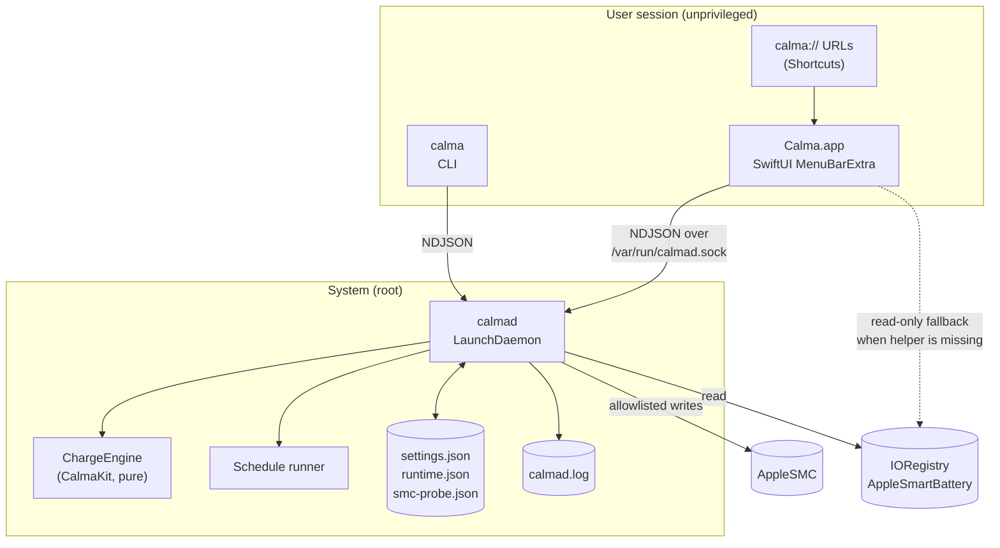
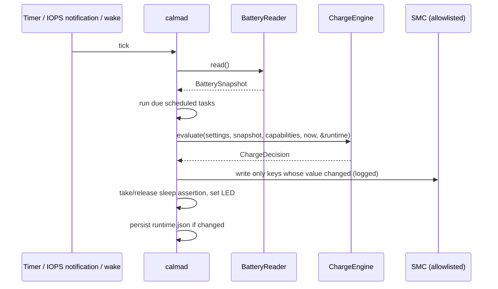

# Architecture

Calma is one Swift package with three shipped programs and two libraries. This document covers how they fit together, how the control loop decides what to do, the IPC protocol, and the threat model.

## Components



| Piece | Privilege | Responsibility |
|---|---|---|
| `Calma.app` | User | UI, settings editing, notifications, `calma://` URLs, heartbeat, helper install/uninstall. It never writes to the SMC. |
| `calma` (CLI) | User | Sends the same commands as the app. Includes `probe`, a read-only SMC dump. |
| `calmad` | root | The control loop, schedule runner, sleep/wake handling, power assertions, `pmset` calls, and **all SMC writes**. |
| `CalmaKit` | n/a | Models, `CalmaSettings`, `ChargeEngine`, `ScheduleCalculator`, `CalmaCommand`/`CalmaResponse`, socket client. No IOKit. |
| `CalmaHardware` | n/a | `CSMC` C layer, `SMCConnection`, `SMCKey` allowlist, `AllowlistedSMC`, `BatteryReader`, `PowerSourceObserver`. |

### Installed files

| Path | Purpose |
|---|---|
| `/Library/PrivilegedHelperTools/calmad` | Daemon binary |
| `/Library/LaunchDaemons/io.github.milanpatel35.calmad.plist` | launchd job (`RunAtLoad`, `KeepAlive`) |
| `/var/run/calmad.sock` | IPC socket |
| `/Library/Application Support/Calma/settings.json` | User settings, including the schedule |
| `/Library/Application Support/Calma/runtime.json` | Engine state (mode, recalibration stage, Heat Guard phase) |
| `/Library/Application Support/Calma/smc-probe.json` | Original key values recorded before the first write |
| `/Library/Logs/Calma/calmad.log` | Rotating write log |

### Why a Unix socket and not XPC?

The textbook design is `SMAppService.daemon` plus XPC, with each side checking the other's code signature. Those checks are only meaningful with a paid Apple Developer ID, and community builds of Calma are ad-hoc signed. A Unix domain socket combined with kernel-verified caller credentials (`getpeereid`) gives a clear and auditable security boundary that works for any build. Moving to `SMAppService` + XPC once releases are notarized is on the roadmap.

## Hardware backends

At startup `calmad` checks which keys exist and picks a backend (`ChargeBackend`):

| Backend | Detected when | Charge inhibit | Adapter off (drain) |
|---|---|---|---|
| `appleSiliconModern` | `CHTE` exists | `CHTE` = `01000000` | `CHIE` = `08` |
| `appleSiliconLegacy` | `CH0B`/`CH0C` exist on Apple Silicon | `CH0B`+`CH0C` = `02` | `CH0I` = `01` |
| `intel` | Intel CPU | `BCLM` = limit, plus `CH0B`/`CH0C` if present | `CH0I` = `01` if present |
| `unsupported` | none of the above (for example macOS 27) | none, monitoring only | none |

The result is published as `Capabilities` (`canInhibitCharging`, `canDrain`, `hasMagSafeLED`, `nativeChargeLimit`). The UI hides or disables whatever the Mac can't do. Key details are in [SMC_KEYS.md](SMC_KEYS.md).

## Control loop



`calmad` evaluates on a periodic timer, on every power-source notification (plug, unplug, percentage change), and on wake. It only writes a key when the desired value differs from the last value it wrote, which keeps the log readable and avoids needless SMC traffic.

### Engine decision table

`ChargeEngine.evaluate` is a pure function. `level` is the macOS percentage, or the raw controller percentage when True Percentage is on. Rules apply top to bottom:

| # | Situation | Charging | Adapter | Notes |
|---|---|---|---|---|
| 1 | Just unplugged while **Full Charge** is active | n/a | n/a | Mode returns to normal |
| 2 | **Recalibrate**: charge to full / recharge / hold | ✅ | ✅ | Advances at 100%. The hold stage finishes after 1 h |
| 3 | **Recalibrate**: drain to low | ❌ | ❌ | Advances at ≤ 10% |
| 4 | **Full Charge** | ✅ | ✅ | |
| 5 | **Drain to N**, level > N | ❌ | ❌ | At ≤ N, returns to normal |
| 6 | Normal, **Pause Charging** on | ❌ | ✅ | |
| 7 | Normal, **Auto Drain**, plugged in, level > limit | ❌ | ❌ | |
| 8 | Normal, limit = 100 | ✅ | ✅ | Stock behaviour |
| 9 | Normal, level ≥ limit | ❌ | ✅ | Latch off |
| 10 | Normal, level < limit − drift (drift = 0 when off) | ✅ | ✅ | Latch on |
| 11 | Normal, inside the drift band | latch | ✅ | Keeps the previous state |

After the mode rules:

- **Heat Guard** (skipped during Recalibrate): `idle` → `paused(5 min)` when the temperature is at or above the threshold and the battery wants to charge. When the pause ends: if it's still hot (or the temperature is unknown), pause again; otherwise `resumed(5 min)`, during which heat is ignored, then `idle`.
- **Capability clamps**: without an inhibit key, charging is always allowed. Without a drain key, the adapter is always on. When unplugged, the adapter is always on, so plugging back in is safe.
- **Sleep assertion**: held while draining or recalibrating on AC, and while charging toward the limit if Stay Awake to Limit is on.
- **LED**: `status` mode shows amber while charging, amber (optionally blinking) while draining, and green otherwise.
- **State** for the menu bar icon: `onBattery`, `draining`, `heatPaused`, `charging` or `paused`.

Pause on Sleep isn't part of the engine. `calmad` handles it directly on `kIOMessageSystemWillSleep` by writing the inhibit value before allowing sleep, then re-evaluates on wake.

## IPC protocol

- Transport: Unix domain stream socket at `/var/run/calmad.sock`.
- Framing: one JSON object followed by `\n` in each direction, **one request per connection**.
- Encoding: Swift `Codable` with ISO-8601 dates. Enum cases with associated values encode as `{ "case": { … } }`.
- Maximum message size: 1 MiB.

### Request examples

```json
{"status":{}}
{"setChargeLimit":{"_0":80}}
{"setChargingPaused":{"_0":true}}
{"startDrain":{"target":60}}
{"startFullCharge":{}}
{"startRecalibration":{}}
{"cancelMode":{}}
{"appHeartbeat":{}}
{"emergencyReset":{}}
{"updateSettings":{"_0":{"chargeLimit":75,"driftRangeEnabled":true,"driftRange":5, "...": "..."}}}
```

### Response

```json
{
  "ok": true,
  "message": "Charge limit set to 80%",
  "status": {
    "battery": { "percentage": 80, "hardwarePercentage": 79, "isPluggedIn": true, "isCharging": false,
                 "temperature": 30.6, "adapterWatts": 80, "systemPowerIn": 5.7, "...": "..." },
    "settings": { "chargeLimit": 80, "...": "..." },
    "runtime": { "mode": { "normal": {} }, "heatGuard": { "idle": {} }, "chargingLatch": false },
    "state": "paused",
    "capabilities": { "backend": "appleSiliconModern", "canInhibitCharging": true, "canDrain": true,
                      "hasMagSafeLED": true, "modelIdentifier": "Mac16,1", "osVersion": "…" },
    "summary": "Holding at 80% · Adapter 80 W",
    "lastChangedBy": "milan",
    "daemonVersion": "0.1.0",
    "taskHistory": []
  }
}
```

On error: `{"ok": false, "error": "Battery is below 20% — draining refused"}`.

### Authorization

| Command | Who may send it |
|---|---|
| `status`, `appHeartbeat`, `appWillQuit` | Any local user |
| Everything else | uid 0, or members of the `admin` group |

The daemon gets the caller's uid and gid from the kernel with `getpeereid`, which can't be spoofed, and checks group membership itself. Every command then goes through `CommandValidator` (ranges, hardware capabilities, battery level and temperature) before it has any effect.

## Threat model

**Assets:** the ability to write SMC keys (root), and the battery's health.

| Threat | Mitigation |
|---|---|
| A local non-admin user changes charging behaviour | Changing commands require root or `admin` group membership, checked with `getpeereid` |
| A malicious local process uses `calmad` to write arbitrary SMC keys | No such command exists. `AllowlistedSMC` rejects any key outside `SMCKey.writeAllowlist` before it reaches IOKit. Value widths must match the key's declared size, which the C layer checks |
| Bad input (limit 5%, drain at 3%) | `CalmaSettings.sanitize()` clamps values and `CommandValidator` refuses unsafe actions |
| Oversized or malformed messages | 1 MiB cap, strict JSON decoding, one request per connection with timeouts |
| The app crashes and leaves charging inhibited | Heartbeat watchdog: without *Keep Limit After Quit*, charging is restored after 90 s of silence |
| The daemon dies | launchd `KeepAlive` restarts it, and it re-applies state. On `SIGTERM` it restores stock charging first, unless *Keep Limit After Quit* is on |
| The helper binary or plist is replaced | Both are root-owned (`root:wheel`, not group- or world-writable), which requires admin rights. Ad-hoc builds can't be verified with a signature; notarized builds are planned |
| The firmware changes key meanings | Backend detection runs at every start. Unknown firmware falls back to `unsupported` (monitoring only) instead of guessing |
| Privacy leaks | No network calls apart from the opt-in update check, and logs stay local |

Out of scope: attackers who already have root, and physical attacks.
